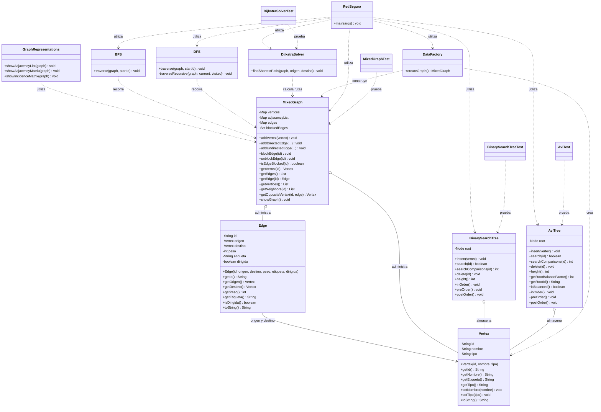

# DIAGRAMA UML - RED SEGURA

```mermaid
classDiagram

    class Vertex {
        -String id
        -String nombre
        -String tipo
        +Vertex(id, nombre, tipo)
        +getId() String
        +getNombre() String
        +getEtiqueta() String
        +getTipo() String
        +setNombre(nombre) void
        +setTipo(tipo) void
        +toString() String
    }

    class Edge {
        -String id
        -Vertex origen
        -Vertex destino
        -int peso
        -String etiqueta
        -boolean dirigida
        +Edge(id, origen, destino, peso, etiqueta, dirigida)
        +getId() String
        +getOrigen() Vertex
        +getDestino() Vertex
        +getPeso() int
        +getEtiqueta() String
        +isDirigida() boolean
        +toString() String
    }

    class MixedGraph {
        -Map vertices
        -Map adjacencyList
        -Map edges
        -Set blockedEdges
        +addVertex(vertex) void
        +addDirectedEdge(...) void
        +addUndirectedEdge(...) void
        +blockEdge(id) void
        +unblockEdge(id) void
        +isEdgeBlocked(id) boolean
        +getVertex(id) Vertex
        +getEdges() List
        +getEdge(id) Edge
        +getVertices() List
        +getNeighbors(id) List
        +getOppositeVertex(id, edge) Vertex
        +showGraph() void
    }

    class GraphRepresentations {
        +showAdjacencyList(graph) void
        +showAdjacencyMatrix(graph) void
        +showIncidenceMatrix(graph) void
    }

    class BFS {
        +traverse(graph, startId) void
    }

    class DFS {
        +traverse(graph, startId) void
        -traverseRecursive(graph, current, visited) void
    }

    class DijkstraSolver {
        +findShortestPath(graph, origen, destino) void
    }

    class BinarySearchTree {
        -Node root
        +insert(vertex) void
        +search(id) boolean
        +searchComparisons(id) int
        +delete(id) void
        +height() int
        +inOrder() void
        +preOrder() void
        +postOrder() void
    }

    class AvlTree {
        -Node root
        +insert(vertex) void
        +search(id) boolean
        +searchComparisons(id) int
        +delete(id) void
        +height() int
        +getRootBalanceFactor() int
        +getRootId() String
        +isBalanced() boolean
        +inOrder() void
        +preOrder() void
        +postOrder() void
    }

    class DataFactory {
        +createGraph() MixedGraph
    }

    class RedSegura {
        +main(args) void
    }

    class AvlTest
    class BinarySearchTreeTest
    class MixedGraphTest
    class DijkstraSolverTest

    Edge --> Vertex : origen y destino
    MixedGraph o-- Vertex : administra
    MixedGraph o-- Edge : administra
    GraphRepresentations ..> MixedGraph : utiliza
    BFS ..> MixedGraph : recorre
    DFS ..> MixedGraph : recorre
    DijkstraSolver ..> MixedGraph : calcula rutas
    BinarySearchTree o-- Vertex : almacena
    AvlTree o-- Vertex : almacena
    DataFactory ..> MixedGraph : construye
    DataFactory ..> Vertex : crea
    RedSegura ..> DataFactory : utiliza
    RedSegura ..> MixedGraph : utiliza
    RedSegura ..> BinarySearchTree : utiliza
    RedSegura ..> AvlTree : utiliza
    RedSegura ..> BFS : utiliza
    RedSegura ..> DFS : utiliza
    RedSegura ..> DijkstraSolver : utiliza

    AvlTest ..> AvlTree : prueba
    BinarySearchTreeTest ..> BinarySearchTree : prueba
    MixedGraphTest ..> MixedGraph : prueba
    DijkstraSolverTest ..> DijkstraSolver : prueba
```

